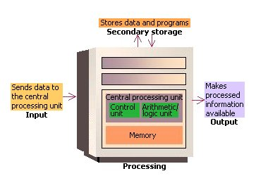

# What is a Computer?

<table>
  <tr>
    <td width="50%">
      
    </td>
    <td width="50%">
      Computer is good.
    </td>
  </tr>
</table>

This is a very basic question and seems simple, but when you start thinking, you might get lost in lots of answers or no answer.

The truth is, there is no one answer to this question. Computers were present even before the transistor, in theoretical and mechanical forms.

## Historical Evolution

- In the early 19th century, the term "computer" referred to humans who could solve calculations by hand or with the help of simple mechanical devices. 
- Over time, the definition evolved to include mechanical and electromechanical devices, such as the abacus, the Antikythera mechanism, and later, devices like the Babbage Engine and Hollerith's tabulating machines.

## The Turing Machine

It was the scientist Alan Turing, known as the father of the modern computer, who described a machine that was named the Turing Machine. 

A Turing machine is a simple, theoretical device invented by the mathematician Alan Turing in 1936 to help understand the limits of what can be computed.

Imagine it like this:

1. **Tape**: Picture an infinitely long strip of paper (the tape) divided into small squares. Each square can hold a symbol (like a 0 or 1).
2. **Head**: There is a read/write head that moves along the tape, one square at a time. It can read the symbol in the current square, write a new symbol, and then move left or right.
3. **State**: The machine is always in one of a finite number of states. Based on the current state and the symbol it reads, it will write a new symbol, move the head, and switch to a new state according to a set of rules (the program).

Using these simple actions, a Turing machine can perform any computation that can be algorithmically defined. This concept is fundamental because it helps define what it means for a problem to be computable and is the basis for modern computer science.

## Modern Computers

Every computer that we use today, from the computer or cell phone you are reading this on to supercomputers, can come under the Turing Machine at their most simplistic level.

All it needs to do is anything that can process data held on your computer by a given set of instructions and algorithms.