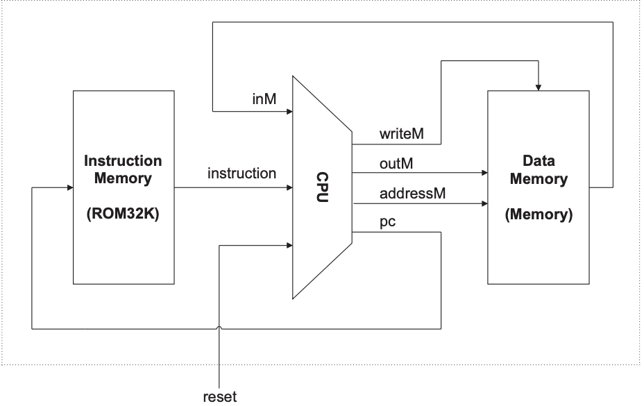
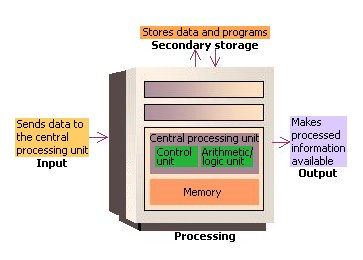
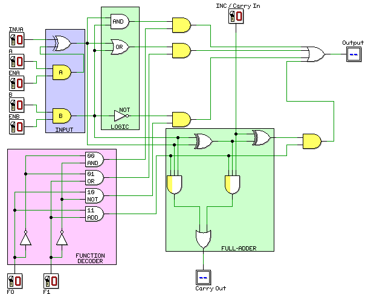

# hack-computer

> [!NOTE]
> ... work in progress !!!
>
> ... i wanted to understand how computer work.
>
> ... “what i cannot build. i do not understand.” ― richard feynman
>
> ...  well, the story we are telling you is that God told us "Here's a logic gate, NAND, now go and build a computer And when we asked God how can we possibly do that, God said "One step at a time" -Shimon Schocken 
>
> ... i agreed and this document details my journey of building a computer from first principles, don't panic, and always remember to bring your towel! 
>
> ... this repo is just for learning purposes.
>
> ... curently writing my understanding in one text ofpieace just to reflect my understanding of first part of computer.

### Table-of-Contents

- [Overview](#overview)
- [why there is hype for semiconductor ?](#why-there-is-hype-for-semiconductor)
- [0000-computer](#0000-computer)
- [0001-logic-gates](#0001-logic-gates)
- [0010-arithmetic logic unit](#0010-Arithmetic-Logic-Unit)
- [0011-memory](#0011-memory)
- [0100](#0100)
- [0101](#0101)
- [0110](#0110)
- [0111](#0111)
- [1000](#1000)
- [1001](#1001)
- [1010](#1010)
- [1011](#1011)
- [1100](#1100)

## Overview

I explored lots of resources for building a computer from first principles, but most were either unstructured or too complex to get easily.

I've decided to follow the [Nand2Tetris](https://www.nand2tetris.org) and [FromTheTransitor](https://www.fromthetransistor.com`) since I prefer to focus less on electronics. In the future, I might explore the [Ben Eater](https://eater.net) way.

### What is a hack-computer ?

It is 16-bit computer that you build from scratch as part of the Nand2Tetris course.

It is the simpler to build but fully functional.

you start building with basic logic gates all the way to working computer.

#### Architecture of hack-computer 

**Instruction Memory (ROM32K):** stores the program instructions in read-only memory.

**CPU (Central Processing Unit):** executes instructions and controls in & out with memory.

**Arithmetic Logic Unit (ALU):** performs arithmetic and logical operations.

**Registers:** fast storage locations within the CPU for temporary data holding.

**Data Memory (Memory):** stores data for the CPU in read/write memory.

**Instruction Set:** the set of commands the computer can execute.

## Why there is hype for semiconductor?

To make computers, we need lots of transistors.

To make transistors, we need semiconductors(silicon).

but how we made cpu out of [semiconductors](https://youtu.be/dX9CGRZwD-w?si=MLNNbRuIsUcUVQHE).

### What is Transistor ? 
 
we need logic gates to make computer, as it is the basic units for performing logical operations in digital circuits.

to make logic gates we need [transistor](https://www.fromthetransistor.com), can act as electronic switches and amplifiers.
 
transistor is a semiconductor device used to amplify or switch electronic signals.(acting like an on-off switch that helps determine which bits should pass and which should not).
common type of transistor used in digital circuits is the MOSFET (Metal-Oxide-Semiconductor Field-Effect Transistor).
 
there are two main types of MOSFETs:

  - PMOS (P-channel MOSFET)
  - NMOS (N-channel MOSFET)

we use a combination of PMOS and NMOS transistors to create diff logic gates and more complex circuits. 

this combination is known as CMOS (Complementary Metal-Oxide-Semiconductor) technology.

that's it i will not get into more of this for now.

## 0000-computer

<table>
  <tr>
    <td width="50%">
      
    </td>
    <td width="50%">
     the basic components and flow of a computer system, including input, processing (with a central processing unit, memory, and secondary storage), and output. 
  </tr>
</table>

What is a **[computer](0000/0000.md)** ? (poorly written blog)

## 0001-logic-gates

NAND is All You Need !!

[logic gates](0001-week/0001.md) are fundamental components of computer science. Everthing started with logic gates. 
from performing basic boolean operations that used in arithemtic calculations to control functions. 
by combining these gates in complex design, computers can process binary data, manage memory,
and execute instructions. 

this is simple design of CPU made with logic gates.

## 0010-Arithmetic Logic Unit(ALU)

the alu is the computational core of the cpu, performing all arithmetic calculations (`addition`, `subtraction`, `multiplication`, `division`, and more).
it processes data through various circuits built from basic logic gates and outputs results. since the cpu is made of logic gates, the alu is also composed of logic gates and multiplexers.

## 0011-Memory

## 0100-Machine language

## 0101-Computer Architecture